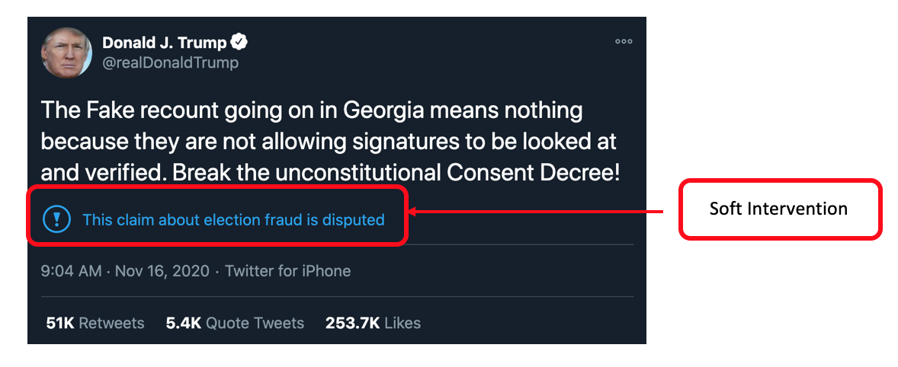
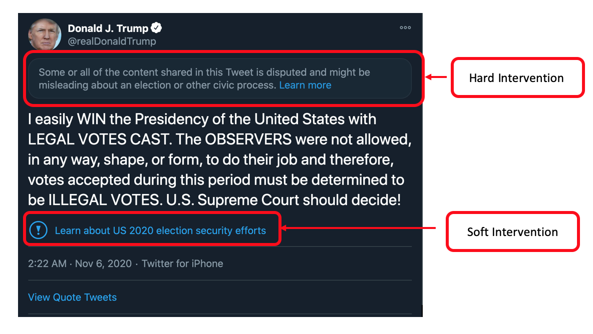

# twitter_elections_public_interest
Megan Brown

Dataset of public interest interventions on Twitter for politicians and candidates during the 2020 US General Elections

## Dataset

This dataset contains Twitter public interest intervention labels for tweets by a selected group of politicians starting on November 1, 2020. 
The list of politicians included in this dataset can be found in [politicians.csv](https://github.com/SMAPPNYU/twitter_elections_public_interest/blob/main/politicians.csv). The politicians CSV contains Members of Congress, candidates
for federal office in 2020, prominent political organizations, and prominent members of the executive branch such as the President, Vice President, and various cabinet members.

The misinformation labels dataset is contained in CSVs within the [data/](https://github.com/SMAPPNYU/twitter_elections_public_interest/tree/main/data) directory of this repository. Tweets are sorted into files based on the date they were published.

Note that this dataset may not be completely inclusive of all tweets by the politicians during the time period, but effort was made to collect as many
tweets as possible from the user set in question.

## Twitter Interventions

To our knowledge, there are two types of Twitter interventions: soft interventions and hard interventions. Soft interventions include a label on the 
tweet with context and an external URL providing additional information. Soft intervention tweets may also include a prompt asking the user to consider the validity of 
the information contained in the tweet prior to retweeting or quote tweeting it. 


There are also hard interventions, where Twitter takes measures in addition to the soft intervention. The hard intervention requires users to
click on the tweet before the text of the tweet is shown and limits users' ability to direct message or retweet the tweet. 



## Data Definitions

These are the data definitions for the interventions dataset:

| field | API field | definition |
| ------ | ------- | ----- | 
| created_at | created at | the UTC time the tweet was created |
| id_str | id_str | the string representation of the unique identifier for this Tweet. Implementations should use this rather than the large integer in `id` |
| user__id_str | user.id_str | the string representation of the unique identifier for this User |
| user__screen_name | user.screen_name | the screen name, handle, or alias that this user identifies themselves with. screen_names are unique but subject to change |
| collection_date | n/a | the UTC timestamp the data was collected | 
| user__highlighted_label | n/a | the label for candidates for public office, see [here](https://help.twitter.com/en/using-twitter/election-labels) for more details about who Twitter labels |
| soft_intervention | n/a | (bool) True if there was a soft intervention on the tweet, False if there was no intervention in the tweet (note that all Tweets with hard interventions also have soft interventions) |
| hard_intervention | n/a | (bool) True if there was a hard intervention on the tweet, False if there was not a hard intervention (note that there still may be a soft intervention) |
| soft_intervention_label | n/a | the string text of the soft intervention label for the tweet |
| soft_intervention_url | n/a | the URL contained within the soft intervention -- may lead to a Twitter moment or external data source |
| hard_intervention_text | n/a | the string text of the hard intervention label for the tweet |
| hard_intervention_action_label | n/a | the string text of the action label for the hard intervention |
| hard_intervention_url | n/a | the URL contained within the hard intervention -- may lead to a Twitter moment or external data source | 

Please contact nyu-smapp-engineers [at] nyu.edu if you have additional questions about the data or other fields.

## Notes

Maintenance of this dataset may not continue once it is no longer relevant or timely to do so.

Please submit an [issue](https://github.com/SMAPPNYU/twitter_elections_public_interest/issues) if you are having problems with the dataset.

## Citation

This dataset is collected and maintained by Megan Brown at the Center for Social Media and Politics. 

If you use this dataset in your research please cite it as:
```
@misc{brown_twitter_public_interventions,
  author       = {Megan Brown},
  title        = {SMAPPNYU/twitter_elections_public_interest},
  month        = nov,
  year         = 2020,
  doi          = {0.5281/zenodo.4967863},
  url          = {https://github.com/SMAPPNYU/twitter_elections_public_interest}
}
```
